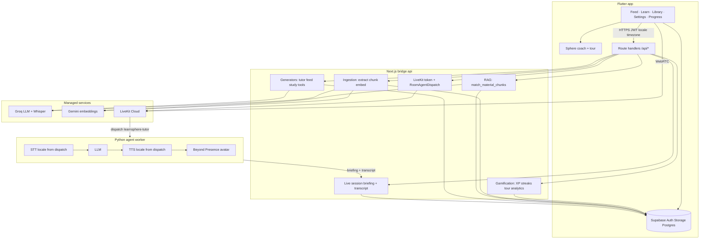
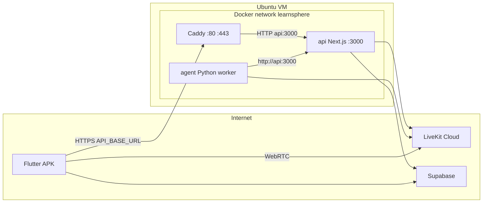

# LearnSphere

LearnSphere is a mobile-first study companion built around a **Live AI tutor** you can talk to like a real instructor—voice in, voice out, with a lip-synced video avatar on a live call. Private study spaces hold your materials; AI stays grounded in what you uploaded, not generic chat. The Flutter app (Android and iOS) is the product surface; a companion **Next.js app** in [`api/`](api/) serves both the **bridge API** (ingestion, retrieval, generation, session orchestration) and a **public landing site** at the root domain; a **Python LiveKit worker** in [`agent/`](agent/) runs the real-time conversation loop.

---

## Live AI tutor

The headline experience is a **real-time tutoring session**: you speak naturally, the tutor listens and replies in spoken voice, and a video avatar faces you on the call—turn-taking, interruptions, and back-and-forth like a human session, not a chat box with a “play audio” button.

**What makes it feel like a real tutor**

- **Voice conversation** — You talk; the worker runs speech-to-text, reasoning, and text-to-speech in a low-latency loop (LiveKit Agents + inference models).
- **Video presence** — A Beyond Presence avatar publishes into the same LiveKit room so lip movement matches what you hear.
- **Grounded teaching** — Before the call, the bridge builds a briefing from your study space (indexed PDFs, notes, transcripts) or from a YouTube link / lesson brief, so answers stay tied to *your* content.
- **Modes** — Library tutor, step-by-step lesson from your brief, video engagement coach, and YouTube transcript walkthrough.
- **Continuity** — The session transcript is saved through the bridge so the conversation is not lost when you leave the room.
- **Multilingual voice** — When your Settings language supports live voice, the bridge embeds locale-specific STT/TTS in the LiveKit dispatch; the worker applies them for that session (see [`api/src/lib/app-language.ts`](api/src/lib/app-language.ts)).

Open **Learn → Live tutor** tab, pick a mode, and start the video call once the API and [`agent/`](agent/) worker are running (see [Run the live tutor worker](#run-the-live-tutor-worker)). Use **Chat & voice** on the same tab for text/voice Q&A without joining a LiveKit room.

### Screenshots

Add PNG or JPG files under [`docs/screenshots/`](docs/screenshots/) and uncomment the block below (or replace the placeholders with `` tags).

<!-- LIVE TUTOR SCREENSHOTS — uncomment when assets exist:

<p align="center">
  
  &nbsp;&nbsp;
  
</p>

<p align="center">
  
  &nbsp;&nbsp;
  
</p>

-->

| | |
| :---: | :---: |
| **Live call** | **In conversation** |
| `docs/screenshots/live-tutor-call.png` | `docs/screenshots/live-tutor-speaking.png` |
| *Recommended: full-screen call UI with avatar visible* | *Recommended: mid-session, mic active, tutor responding* |
| | |
| **Learn tab** | **Mode / setup** |
| `docs/screenshots/live-tutor-learn-tab.png` | `docs/screenshots/live-tutor-mode-picker.png` |
| *Recommended: navigation to Live tutor* | *Recommended: mode selection or pre-call briefing* |
| | |
| **Sphere coach** | **Progress & analytics** |
| `docs/screenshots/sphere-coach-tour.png` | `docs/screenshots/progress-analytics.png` |
| *Recommended: mascot + tour bubble on Feed or Learn* | *Recommended: streak, daily goal, activity chart* |

---

## Introduction

Students and self-learners juggle PDFs, lecture recordings, YouTube, and notes across apps, then ask a chatbot questions that ignore their actual syllabus. LearnSphere keeps everything in **study spaces** you control: upload or link sources, index them once, then **talk to the live tutor**, use text or voice chat, run quizzes, and scroll a learning feed—all citing pages, timestamps, or chunks from **your** library. **Sphere**, the in-app coach, guides onboarding, streaks, and XP so study habits stick.

The system is deliberately split: the phone handles auth, storage uploads, and UX; the bridge holds provider keys and heavy logic; the live worker owns the low-latency voice loop. That is not a thin wrapper around a single API call—it is a small **multi-process, multi-agent pipeline** with RAG, structured generation, gamification, localization, and real-time media.

---

## App navigation

The signed-in shell has three bottom tabs:

| Tab | Route | Purpose |
|-----|--------|---------|
| **Feed** | `/feed` | Swipe learning cards (memes, quizzes, flashcards, etc.) for the active study space |
| **Learn** | `/learn` | **Live tutor** (video call) and **Study tools** (video quizzes, lesson scripts, engagement guides) |
| **Library** | `/library` | Study spaces, uploads, ingest status; FAB to add material |

From any main tab, the header shows your **streak / daily goal** chip, **Settings** (`/settings`), and profile menu. **Progress & analytics** live at `/progress` (also linked from Settings). Legacy paths `/tutor`, `/study`, and `/avatar` redirect into **Learn** with the right tab or chat drawer.

---

## What it solves

| Pain | LearnSphere approach |
|------|----------------------|
| “ChatGPT doesn’t know my course” | Materials are chunked, embedded (Gemini), and retrieved via Postgres `pgvector` before every tutor answer and live briefing. |
| Passive reading | Learning feed and study tools turn sources into quizzes, flashcards, memes, and video-oriented artifacts with validated JSON schemas. |
| Isolated files | Study spaces group materials; tutor and tools always scope to the active space and user (Supabase RLS). |
| Text-only tutoring | **Live AI tutor**: speak and listen on a video call; turn detection, natural dialogue, and a lip-synced avatar in the same LiveKit room as you. |
| Hard to stay consistent | **Sphere coach**: streaks, daily goals, XP for real study actions, guided tour, and contextual nudges on Feed / Learn / Library. |
| One-language-only apps | **24 UI languages**; generated content and tutors follow `X-LearnSphere-Locale`; live voice uses per-locale STT/TTS (see [Features](#features)). |

---

## Features

### Live & tutoring

- **Live AI tutor (featured)** — Real-time voice and video on a LiveKit call: talk, get spoken answers, see a lip-synced Beyond Presence avatar; modes for library-grounded tutoring, teach-from-brief, video engagement, and YouTube walkthrough; transcript saved after the call; locale-aware STT/TTS when your language supports live voice.
- **Chat & voice tutor** — On **Learn → Live tutor**, open **Chat & voice** for grounded text Q&A or record a voice question (Groq transcription → same RAG tutor path as text). No LiveKit worker required for this sheet.
- **Text tutor (API)** — Multi-turn chat with retrieval-augmented answers, citations (page / timestamp), and locale-aware prompts.

### Learning content

- **Learning feed** — Generate and swipe memes (template compositing), quizzes, flashcards, fill-in-the-blank, true/false, and “did you know” cards; submit attempts and mark progress (XP events).
- **Study tools** — Video quizzes with timestamp binding, “video create” lesson scripts, and “video engage” guides; YouTube-aware generation when the library has no local video.

### Library & data

- **Auth** — Email + password, **Google sign-in**, **6-digit email OTP** for sign-up verification, forgot-password and recovery OTP flows (`learnsphere://auth/callback` for deep links where needed).
- **Study spaces & library** — CRUD via Supabase; upload PDF, DOCX, plain text, audio/video; ingest status; signed URLs for viewing.
- **Ingestion & RAG** — Server-side extract (PDF/DOCX/text, Groq transcription for media), overlap chunking, Gemini embeddings, `match_material_chunks` with similarity threshold.

### Sphere coach & progress

- **Sphere mascot** — Draggable coach on main tabs; speech bubble with contextual messages (onboarding, tour, streak at risk, daily goal).
- **Guided tour** — Steps across Feed, Learn (live + tools), Library, and Settings; progress synced via `/api/gamification/tour`.
- **Streaks & XP** — Daily qualifying activities update streaks; XP weights for feed attempts, tutor messages, live sessions, uploads, study-tool generation, etc. (see [`api/src/lib/gamification.ts`](api/src/lib/gamification.ts)).
- **Progress screen** — Streak hero, daily goal ring, activity charts (day / week / month), breakdown by event type; timezone from device (`X-Timezone` header and `timezone` query on gamification routes).

### Personalization

- **Settings** — App language (24 options), theme mode (system / light / dark), accent color, feed card tone, sign out.
- **Profile avatar** — Upload photo to Supabase Storage, pick DiceBear avatars, or restore Google profile photo when signed in with Google (`profiles.avatar_url`, `avatars` bucket).
- **App language** — UI via Flutter l10n; bridge reads **`X-LearnSphere-Locale`** on generation and tutor routes; live sessions store locale on `chat_sessions` and pass STT/TTS choices in LiveKit dispatch metadata. **Sinhala (`si`)** has full UI and text AI; **live video voice** is blocked until STT/TTS providers support it (Settings shows “live voice unavailable”). Existing feed cards keep their generation language until you refresh / generate new ones.

### Onboarding

- Coach and server logic share a **3-step** model: create a study space → upload material → ready for feed/tutor/tools.

Sign-in, spaces, uploads, profile, and local settings work against Supabase (and device storage) alone. **Ingest, tutors, study tools, feed generation, live sessions, and gamification summary/analytics** require the bridge API with provider keys. **Live video tutor** additionally requires the Python worker and LiveKit + Beyond Presence.

---

## Architecture (technical)



| Layer | Stack | Role |
|-------|--------|------|
| Mobile | Flutter, Riverpod, go_router, Dio, l10n (24 locales) | UX, coach overlay; Supabase client + HTTPS bridge client (`API_BASE_URL`) |
| Data | Supabase (Postgres, Storage, Auth, RLS, pgvector) | Users, profiles, materials, chunks, sessions, artifacts, `user_gamification`, `user_activity_events` |
| Bridge + site | Next.js 16 standalone in Docker locally/on VM, Vitest | `/api/*` orchestration and gamification recording **plus** the public landing site at `/` (marketing pages + Android download) |
| Edge | **Caddy 2** on VM (production) | TLS, reverse proxy to bridge; long timeouts for generate/ingest |
| Live worker | LiveKit Agents in Docker, Beyond Presence plugin | Long-running RTC session; STT/LLM/TTS from dispatch metadata |
| Models | Groq (chat + transcription), Gemini (embeddings), LiveKit Inference (live STT/LLM/TTS), Cartesia/Inworld TTS per locale | Chosen per workload |

Local development runs **api** and **agent** with `pnpm dev` / `python agent.py dev` instead of Docker; production uses [`deploy/`](deploy/). See [Production deployment (VM + Docker)](#production-deployment-vm--docker).

### Bridge API surface

| Area | Methods | Path |
|------|---------|------|
| Study spaces | GET, POST | `/api/study-spaces` |
| Materials | GET, POST | `/api/materials` |
| Ingest | POST | `/api/materials/[id]/ingest` |
| Material status / URL | GET | `/api/materials/[id]/status`, `.../signed-url` |
| Learning feed | GET | `/api/feed` |
| Generate feed pack | POST | `/api/learning/generate` |
| Feed attempt / progress | POST | `/api/learning/[id]/attempt`, `.../progress` |
| Text tutor sessions | GET, POST | `/api/tutor/sessions`, `.../[id]/messages` |
| Voice tutor question | POST (multipart) | `/api/tutor/sessions/[id]/voice` |
| Study tools | GET, POST | `/api/study-tools`, `.../[id]/attempts` |
| Live tutor session | POST, DELETE | `/api/live-tutor/session` (POST create; DELETE `?sessionId=` clears briefing cache) |
| Live briefing / transcript | GET, POST | `/api/live-tutor/session/[id]/briefing`, `.../transcript` |
| Gamification | GET, PATCH | `/api/gamification/summary`, `.../analytics`, `.../tour` |
| Health / diagnostics | GET | `/api/health` (public: config + `origin.publicOrigin`), `/api/auth/session` (validates a Bearer token) |
| Android download | GET | `/api/download/android` (302 → newest release APK) |

Authenticated routes expect the Supabase JWT. The app sends **`X-LearnSphere-Locale`** on bridge calls and **`X-Timezone`** (plus `timezone` query on some gamification GETs) so streaks and charts use the learner’s local calendar day.

---

## How the multi-agent system works

“Multi-agent” here means **specialized runtimes coordinated by explicit contracts**, not one monolithic prompt.

### 1. Bridge agent (orchestrator)

Beyond the landing site at `/`, the Next.js app is primarily an **orchestration layer** under `/api/*`:

- **Ingest agent path** — Download from Storage → format-specific extraction → sliding-window chunks → embedding batches → replace `material_chunks` for that material.
- **Retrieval agent path** — Embed the user question as `RETRIEVAL_QUERY`, call `match_material_chunks`, filter by similarity, attach citation metadata.
- **Text tutor path** — Build context from retrieved chunks, call Groq with JSON-shaped answers when possible, map `citation_ids` back to rows the user can open in the library; honor `languageCode` from the app locale; optional **voice** entry transcribes audio then reuses the same answer path.
- **Generation agents** — Separate pipelines for learning feed (`meme-generator`: concept “atoms” → per-kind payloads → meme rasterization from local templates) and study tools (Zod-validated video quiz / create / engage payloads, including YouTube context helpers).
- **Gamification path** — `recordActivityFailOpen` on feed attempts, tutor messages, live session start, uploads, study-tool generation, and quiz completion; updates streaks/XP in `user_gamification` and append-only `user_activity_events` (idempotent keys where needed); summary + analytics + coach tour state exposed to the client.
- **Live session agent** — On session create, assemble mode-specific **teaching instructions** from ready materials and optional YouTube/brief; reject live voice for unsupported locales; cache briefing server-side; mint LiveKit token with **RoomAgentDispatch** (session id, Supabase JWT, locale, STT/TTS fields) so only bridge-created rooms pull in the worker.

Each path owns validation, error surfaces to the client, and tests (e.g. ingestion, retrieval, meme templates, study-tools routes).

### 2. Live tutor worker (real-time agent)

When the learner starts a live session:

1. Bridge creates a DB session and returns a LiveKit URL, room name, and JWT.
2. The JWT’s room config dispatches agent name **`learnsphere-tutor`** with metadata: `sessionId`, Supabase access token, **`locale`**, and **STT/TTS** hints from [`app-language.ts`](api/src/lib/app-language.ts).
3. The Python worker connects, **GET** `/api/live-tutor/session/{id}/briefing` for instructions and greeting, starts `AgentSession` (locale-aware STT → LLM → TTS, turn detector), starts Beyond Presence **AvatarSession** into the room, greets, then loops on speech.
4. Each conversation item is **POST**ed to `/api/live-tutor/session/{id}/transcript` so history survives the call.

The worker does not re-implement RAG in the hot path—the bridge pre-computes the teaching prompt from indexed chunks (and YouTube transcript when in `youtube_tutor` mode). The worker focuses on **latency, audio, and avatar sync**.

### 3. Client as coordination agent

The Flutter app chooses study space, triggers ingest, drives feed/tools generation, opens text/voice tutor sessions, syncs locale to `profiles.preferred_locale`, loads gamification summary for Sphere, and joins LiveKit with the minted token. It never holds Groq/Gemini/LiveKit secrets.

### Why this is not “just a wrapper”

Integrations (Groq, Gemini, LiveKit, Beyond Presence) sit behind **first-party logic**:

- Custom chunking, overlap, and ingest for PDF/DOCX/media—not “send file to model.”
- Postgres RPC vector search with user/space isolation—not generic vector DB SDK demos.
- Tutor answers constrained to retrieved chunk IDs and citation objects—not raw markdown hallucinations.
- Learning feed **multi-stage** generation (atoms → emotional shape → kind-specific schema → meme compositing with bundled templates).
- Study tools with strict Zod contracts and material/timestamp binding.
- LiveKit **agent dispatch** wiring, briefing TTL cache, mode-specific instruction builders (`tutor`, `video_create`, `video_engage`, `youtube_tutor`), locale-aware live voice gating, and transcript persistence.
- Gamification: streak logic in local calendar days, XP table, coach copy selection, guided tour versioning, analytics bucketing.
- Automated tests around ingestion, validation, feed parsing, gamification, and API routes.

Swapping a provider key changes the model vendor; it does not replace the pipelines above.

---

## Prerequisites

- [Flutter SDK](https://docs.flutter.dev/get-started/install) (3.4+)
- Android Studio / platform tools (`adb`) for physical Android devices
- Xcode for iOS (macOS only)
- [Node.js](https://nodejs.org/) and [pnpm](https://pnpm.io/) for the API
- Python 3.10+ for the live tutor worker
- A [Supabase](https://supabase.com/) project
- A free [LiveKit Cloud](https://cloud.livekit.io/) project and a [Beyond Presence](https://docs.bey.dev/api-key) API key, for the live tutor

## One-time Supabase setup

1. Create a Supabase project.
2. From the repo root, link and push migrations:

   ```bash
   npx supabase login
   npx supabase link --project-ref YOUR_PROJECT_REF
   npx supabase db push
   ```

   Use `npx supabase db push --dry-run` first to preview pending migrations.

3. In the Supabase dashboard, add **`learnsphere://auth/callback`** under Authentication → URL configuration (redirect URLs).

4. **Email sign-up (OTP):** Authentication → Providers → Email → enable **Confirm email**. In **Authentication → Email templates**, edit **Confirm signup** and **Reset password**:
   - Include **`{{ .Token }}`** (the 6-digit code).
   - **Remove** `{{ .ConfirmationURL }}`, `{{ .TokenHash }}`, and any “Click to confirm” link — if those stay in the template, Supabase keeps sending magic links even after you “fix” the wording.
   - The Flutter app does **not** pass `redirect_to` on signup/resend, so new emails should be code-only after you save the template.

5. **Custom SMTP (recommended for production):** Project Settings → Authentication → SMTP. Without this, Supabase’s built-in mail is rate-limited and OTP emails may not arrive reliably.

6. **Google sign-in:** In [Google Cloud Console](https://console.cloud.google.com/), create an OAuth **Web application** client with redirect URI `https://YOUR_PROJECT_REF.supabase.co/auth/v1/callback`. Enable the Google provider under Supabase Authentication → Providers and paste the client ID and secret there (never put these in the Flutter `.env`).

7. After pulling new migrations, run `npx supabase db push` again so `profiles.avatar_url` and the `avatars` storage bucket exist.

## Environment files

**Flutter (repo root)**

```bash
cp .env.example .env.local
```

Edit `.env.local`:

| Variable | Purpose |
|----------|---------|
| `SUPABASE_URL` | Project URL |
| `SUPABASE_ANON_KEY` | Anon/public key |
| `API_BASE_URL` | Bridge API base URL — **`https://learnsphere.knurdz.org`** in production; `http://127.0.0.1:3000` for local dev with `adb reverse` |

**API (`api/`)**

```bash
cp api/.env.example api/.env.local
```

Fill in `NEXT_PUBLIC_SUPABASE_*`, `GROQ_API_KEY`, and `GEMINI_API_KEY`. Add `LIVEKIT_*` if you want the live tutor. Provider secrets stay server-side only.

**Live tutor worker (`agent/`)**

```bash
cp agent/.env.example agent/.env.local
```

Use the same `LIVEKIT_*` values as the API, plus your Beyond Presence key. See [`agent/README.md`](agent/README.md).

## Run the API locally

```bash
cd api
pnpm install
pnpm dev
```

The API listens on [http://localhost:3000](http://localhost:3000). Route handlers live under `/api/*`.

To reach the API from a phone on the same Wi‑Fi without `adb reverse`, bind all interfaces:

```bash
pnpm dev -- -H 0.0.0.0 -p 3000
```

Then set `API_BASE_URL=http://YOUR_LAN_IP:3000` in `.env.local`.

## Run the live tutor worker

The **Live tutor** screen needs this worker running alongside the API:

```bash
cd agent
python3 -m venv .venv
.venv/bin/pip install -r requirements.txt
.venv/bin/python agent.py dev
```

It connects to LiveKit Cloud and waits for the API to dispatch it into a session. Without it, the app joins the room but no tutor ever appears.

## Run the Flutter app

From the repo root (after copying `.env.local`):

```bash
flutter pub get
flutter run
```

Pick your connected device or emulator when prompted.

### Test on a physical Android phone (USB / adb)

1. On the phone: **Settings → About phone** → tap **Build number** seven times to enable Developer options.
2. **Settings → Developer options** → enable **USB debugging**.
3. Connect the phone via USB. Accept the **RSA fingerprint** prompt on the device.
4. On your computer:

   ```bash
   adb devices
   ```

   You should see your device as `device` (not `unauthorized`).

5. Forward the API port so the phone can use `127.0.0.1:3000`:

   ```bash
   adb reverse tcp:3000 tcp:3000
   ```

   Re-run this after unplugging the phone or rebooting either device.

6. Start the API (`cd api && pnpm dev`) with `API_BASE_URL=http://127.0.0.1:3000` in root `.env.local`.

7. Run the app:

   ```bash
   flutter pub get
   flutter run
   ```

Debug builds allow cleartext HTTP to the reversed localhost port on Android.

### iOS (physical device or simulator)

- Install pods if needed: `cd ios && pod install && cd ..`
- Use `flutter run` or open `ios/Runner.xcworkspace` in Xcode.
- There is no `adb reverse` on iOS. Use your Mac’s LAN IP and `pnpm dev -- -H 0.0.0.0 -p 3000`, or run the API on a hosted HTTPS URL.
- Set `API_BASE_URL` in `.env.local` accordingly. Debug builds allow local networking via ATS (`NSAllowsLocalNetworking`).

### Chrome (Flutter web)

Pin a stable port so Google OAuth redirects match a URL you add in Supabase **Authentication → URL configuration → Redirect URLs** (e.g. `http://localhost:8080`):

```bash
cd api && pnpm dev
flutter run -d chrome --web-port=8080
```

Keep `API_BASE_URL=http://127.0.0.1:3000` in `.env.local`. The bridge allows CORS from `localhost` / `127.0.0.1` so the web app can call `/api/*`.

## Verify locally

```bash
flutter analyze
flutter test
cd api && pnpm typecheck && pnpm test
```

## Landing website

The same Next.js app that serves `/api/*` also renders a **public marketing site** at the root of the domain (**`https://learnsphere.knurdz.org/`**). It shares the bridge’s deployment—no separate host or build.

- **Pages** — Hero, feature cards, “how it works”, study tools, FAQ, and an **Android download** call-to-action ([`api/src/app/page.tsx`](api/src/app/page.tsx), [`api/src/app/components/`](api/src/app/components/)).
- **Download button** — Links to **`/api/download/android`**, which 302-redirects to the newest published release APK (or the GitHub Releases page as a fallback), so a new release is picked up without redeploying the site ([`api/src/lib/github-release.ts`](api/src/lib/github-release.ts)). Override with `ANDROID_DOWNLOAD_URL` if needed.
- **Assets** — Landing images live in [`api/public/`](api/public/) alongside `meme-templates/`. Because Next.js **standalone** only traces files the server reads, the Docker image copies the whole `public/` folder (see [`deploy/docker/api.Dockerfile`](deploy/docker/api.Dockerfile)); otherwise landing images 404 in production while meme templates still work.
- **Asset URLs for the app** — Feed meme images are absolute URLs. Behind Caddy the server sees plain HTTP, so the bridge derives the public origin from `PUBLIC_BASE_URL` (or `X-Forwarded-*`) to emit **https** links; verify via `curl https://learnsphere.knurdz.org/api/health` → `origin.publicOrigin`.
- **Local preview** — `cd api && pnpm dev`, then open `http://127.0.0.1:3000/`.

## Production deployment (VM + Docker)

Production runs on a **single Ubuntu VM** (e.g. Azure, ~8 GB RAM) using **Docker Compose**. **`https://learnsphere.knurdz.org`** serves both the **landing site** (`/`) and the **bridge API** (`/api/*`). **Supabase**, **Groq**, **Gemini**, **LiveKit**, and **Beyond Presence** remain external—the VM only runs the **bridge/site**, **live tutor worker**, and **Caddy** reverse proxy.

### DNS and domain

| Piece | Role |
|--------|------|
| **Domain** | `learnsphere.knurdz.org` — hostname in `API_BASE_URL` and Let’s Encrypt |
| **DNS** | **A record** → VM **public IPv4** (e.g. `20.244.109.83`) |
| **Check** | `dig +short learnsphere.knurdz.org` should return the VM IP before TLS can succeed |

The app does **not** use the raw IP in release builds:

```text
API_BASE_URL=https://learnsphere.knurdz.org
```

### Virtual machine layout

| Path | Purpose |
|------|---------|
| `/opt/learnsphere/app` | Git clone of [knurdz/learn-sphere](https://github.com/knurdz/learn-sphere) |
| `/opt/learnsphere/env/api.env` | Bridge secrets (Supabase public vars, Groq, Gemini, LiveKit)—**not in git** |
| `/opt/learnsphere/env/agent.env` | Worker secrets (LiveKit, Beyond Presence)—**not in git** |
| `/opt/learnsphere/app/deploy/` | Compose, Caddyfile, `bootstrap.sh`, `up.sh` |
| `/opt/learnsphere/app/deploy/.env` | `LEARNSPHERE_ENV_DIR=/opt/learnsphere/env` for Docker Compose |

Open **TCP 22, 80, 443** on the cloud NSG and UFW. Details: [`deploy/FIREWALL.md`](deploy/FIREWALL.md).

### Docker services (three containers)

All services use the private network **`learnsphere`** ([`deploy/docker-compose.yml`](deploy/docker-compose.yml)).



| Container | Build / image | Host ports | Role |
|-----------|---------------|------------|------|
| **caddy** | `caddy:2-alpine` | **80**, **443** only | **HTTPS** (Let's Encrypt via ACME), HTTP→HTTPS, **gzip**, reverse proxy to `api:3000` with **300s** timeouts ([`deploy/Caddyfile`](deploy/Caddyfile)) |
| **api** | [`deploy/docker/api.Dockerfile`](deploy/docker/api.Dockerfile) — Next.js **standalone**, Node 22 | Internal **3000** (not published) | All `/api/*` handlers; env from `/opt/learnsphere/env/api.env` |
| **agent** | [`deploy/docker/agent.Dockerfile`](deploy/docker/agent.Dockerfile) — Python LiveKit Agents | None (outbound only) | Real-time tutor + avatar; `LEARNSPHERE_API_URL=http://api:3000`; env from `agent.env` |

**Order:** `api` healthcheck passes → **agent** and **caddy** start. Certificates persist in Docker volume **`caddy_data`**.

### Caddy in this stack

- Binds **only** `learnsphere.knurdz.org` (see Caddyfile).
- Obtains and renews **Let's Encrypt** certs (HTTP-01 on port 80).
- Proxies all paths to the **api** container; long AI routes rely on **300s** proxy timeouts.
- The **api** port is **not** exposed on the host firewall—clients always hit **443**.

### How the Flutter app connects

| Feature | Where it connects |
|---------|-------------------|
| Login, profile, Storage uploads | **Supabase** directly (`SUPABASE_URL`, anon key) |
| Ingest, tutor, feed, tools, gamification, start live session | **HTTPS** → `API_BASE_URL` + Supabase JWT |
| Live video / audio with avatar | **WebRTC** → **LiveKit Cloud** (token from bridge) |
| Worker briefing / transcript | **agent** → **`http://api:3000`** on Docker network (not public) |

Secrets for Groq, Gemini, LiveKit server, and Beyond never ship in the APK.

### Deploy on the VM

**Clone + env (first time):**

```bash
sudo mkdir -p /opt/learnsphere
sudo git clone https://github.com/knurdz/learn-sphere.git /opt/learnsphere/app
sudo mkdir -p /opt/learnsphere/env
sudo cp /opt/learnsphere/app/deploy/env/api.env.example /opt/learnsphere/env/api.env
sudo cp /opt/learnsphere/app/deploy/env/agent.env.example /opt/learnsphere/env/agent.env
sudo nano /opt/learnsphere/env/api.env
sudo nano /opt/learnsphere/env/agent.env
sudo chmod 600 /opt/learnsphere/env/*.env
```

Use the same values as local [`api/.env.local`](api/.env.local) and [`agent/.env.local`](agent/.env.local).

**Install Docker and start** (bootstrap clones if missing, opens UFW, builds, starts stack):

```bash
cd /opt/learnsphere/app
sudo bash deploy/bootstrap.sh
```

One-liner on a fresh VM (after you have placed real secrets in `/opt/learnsphere/env/`):

```bash
curl -fsSL https://raw.githubusercontent.com/knurdz/learn-sphere/main/deploy/bootstrap.sh | sudo bash
```

Or manually: `cd /opt/learnsphere/app/deploy && sudo docker compose up -d --build` (requires `deploy/.env` with `LEARNSPHERE_ENV_DIR`).

**Verify:**

```bash
curl -sI https://learnsphere.knurdz.org
cd /opt/learnsphere/app/deploy && sudo docker compose ps
```

**Redeploy after git changes:**

```bash
cd /opt/learnsphere/app && git pull && sudo bash deploy/up.sh
```

### Android sideload releases

APKs are **not** on the Play Store. Use GitHub **Actions → Android Release** (draft APK). Add repository secrets (keystore + Supabase + `API_BASE_URL=https://learnsphere.knurdz.org`) — see [`docs/android-release.md`](docs/android-release.md). Run the workflow with a tag (e.g. `v0.1.0`), review the draft release, then publish.

### Other hosts

You can deploy [`api/`](api/) alone to Vercel or Cloud Run; run the live worker separately and set `LEARNSPHERE_API_URL` to the public bridge URL. The Docker stack in [`deploy/`](deploy/) is the supported path for **learnsphere.knurdz.org**.

---
## Project layout

| Path | Role |
|------|------|
| `lib/` | Flutter application (screens, widgets, l10n, gamification providers) |
| `lib/l10n/` | Generated + ARB localizations (24 languages) |
| `android/`, `ios/` | Platform projects |
| `api/` | Next.js app: bridge API (`/api/*`) **and** the public landing site (`/`); built via `deploy/docker/api.Dockerfile` for production |
| `api/src/app/page.tsx`, `api/src/app/components/` | Landing website (hero, features, how-it-works, FAQ, Android download CTA) |
| `api/public/` | Static site assets (landing images) + `meme-templates/` used by feed generation |
| `agent/` | Python LiveKit Agents worker; built via `deploy/docker/agent.Dockerfile` for production |
| `deploy/` | **Docker Compose**, **Caddyfile**, VM `bootstrap.sh` / `up.sh`, env examples |
| `deploy/docker/` | Multi-stage Dockerfiles for **api** and **agent** |
| `deploy/env/` | Example `api.env` / `agent.env` for `/opt/learnsphere/env/` on the VM |
| `supabase/` | Database migrations and CLI config |
| `docs/android-release.md` | Keystore + GitHub Actions APK releases |
| `docs/screenshots/` | README marketing captures (see [`docs/screenshots/README.md`](docs/screenshots/README.md)) |

## Troubleshooting

| Symptom | Things to try |
|---------|----------------|
| `adb: device unauthorized` | Revoke USB debugging authorizations on the phone, reconnect, accept RSA prompt |
| `adb: command not found` | Install Android platform-tools; add `adb` to your `PATH` |
| App cannot reach API on Android | Run `adb reverse tcp:3000 tcp:3000`; confirm API is up; use `127.0.0.1` not `localhost` |
| App cannot reach API on Wi‑Fi | Use `-H 0.0.0.0` and LAN IP in `API_BASE_URL`; same network as dev machine |
| Email confirm link fails | Add `learnsphere://auth/callback` in Supabase redirect URLs |
| Build error: asset `.env.local` missing | Copy `.env.example` → `.env.local` at repo root |
| Ingest / tutor errors | Start `api/` and set `GROQ_*` / `GEMINI_*` in `api/.env.local` |
| Live tutor connects but no avatar appears | The `agent/` worker is not running, or its `LIVEKIT_*` values differ from `api/.env.local` |
| Live tutor says LiveKit is not configured | Add `LIVEKIT_URL` / `LIVEKIT_API_KEY` / `LIVEKIT_API_SECRET` to `api/.env.local` |
| Generic API **500** / Dio validateStatus | Often a **broken** Next dev server on port 3000 (stale `api/.next`). Stop all `pnpm dev` processes, then `cd api && rm -rf .next && pnpm dev`. Keep **one** API on port 3000 so it matches `API_BASE_URL=http://127.0.0.1:3000`. |
| **Production:** HTTPS fails / connection refused | Azure (or cloud) NSG must allow **80** and **443**; `sudo docker compose ps` — **caddy** must be **Up**; check [`deploy/Caddyfile`](deploy/Caddyfile) syntax |
| **Production:** Caddy restart loop | Usually invalid Caddyfile; use the repo version (no empty `email` line). `sudo docker compose logs caddy --tail 30` |
| **Production:** `LEARNSPHERE_ENV_DIR` warning | Create `deploy/.env` with `LEARNSPHERE_ENV_DIR=/opt/learnsphere/env` or export before `docker compose` |
| **Production:** API works, live tutor missing | `sudo docker compose logs agent`; match `LIVEKIT_*` in `api.env` and `agent.env`; worker must reach `http://api:3000` |
| **Production:** meme cards show a broken-image icon | The bridge must hand the app **https** asset URLs. `curl https://learnsphere.knurdz.org/api/health` → `origin.publicOrigin` must be the public domain (not `localhost`). Set `PUBLIC_BASE_URL` in `api.env` and recreate the `api` container |
| **Production:** Feed/Library **401** / auth errors | [`deploy/AUTH-CHECK.md`](deploy/AUTH-CHECK.md): `curl …/api/health`, align `SUPABASE_*` in VM `api.env` with GitHub APK secrets; test `…/api/auth/session` with a Bearer token |
